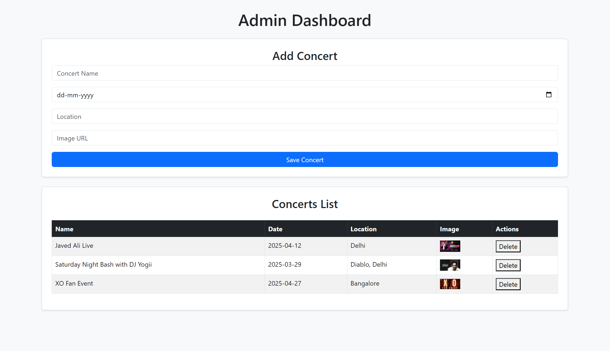
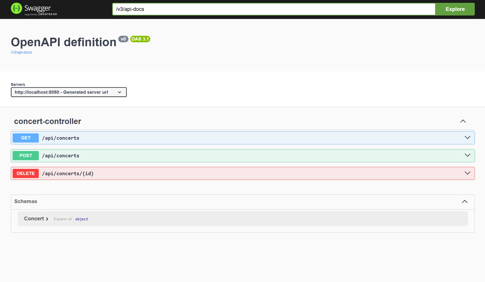

# Concert Craze

**Concert Craze** is a web-based platform for booking tickets to live concert events. It allows users to browse upcoming concerts, book tickets, and manage their bookings. The platform also supports event management by admins.

---

## Project Overview

Concert Craze is built to streamline the concert booking experience. It includes user authentication, event listings, ticket purchase features, and an admin dashboard to manage events. 

The project uses:
- **Frontend:** HTML, CSS, JavaScript
- **Backend:** Java Spring Boot
- **Database:** MySQL

---

## Documentation Links

- [Architecture Diagram](https://docs.google.com/document/d/1O3opYtxxhXzqpzHZaSKCkpvD8FJBjsaM0q-npIpYekA/edit?usp=sharing)  
- [ER Diagram](https://docs.google.com/document/d/12ijJc4_Xcke4Fj18-fr4THZdbfarq2vo9DoxuV8cN9g/edit?usp=sharing)

---

## UI Preview

### Home / Events Page

### Swagger Status (Current Dev Status)

---

## Features

- User registration and login
- Browse and search concerts
- Book and manage tickets
- Admin panel for event management
- RESTful API with Swagger documentation

---

## Contact

For any queries, feel free to reach out at [zahidhussain6143@gmail.com].

---

